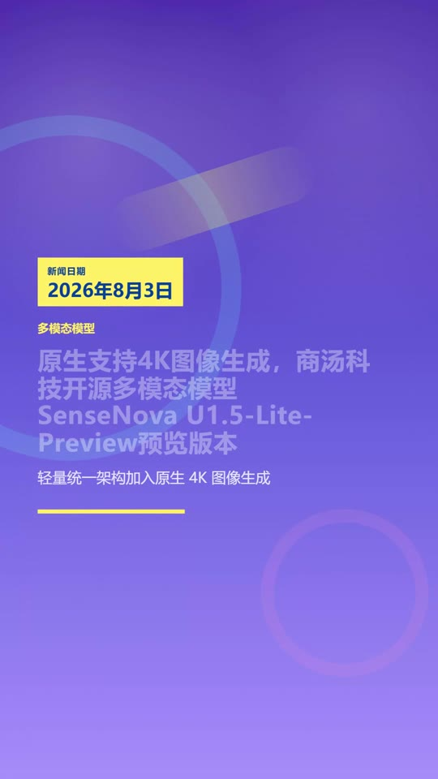
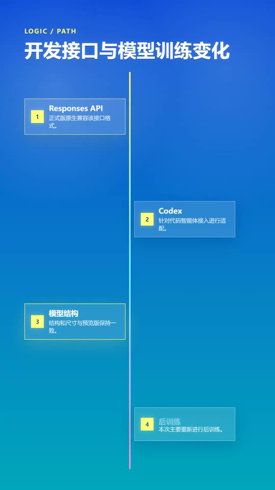
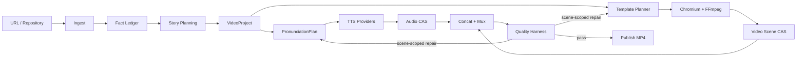

# Scene Gen

[](https://github.com/whut09/scene_gen/actions/workflows/ci.yml)
[](https://nodejs.org/)
[](https://www.typescriptlang.org/)
[](LICENSE)

Scene Gen 将新闻、技术文章或开源项目链接转换为中文竖屏视频。它负责内容抓取、事实约束、分镜规划、语音合成、HTML 动画渲染、音画同步和质量修复，最终输出可发布的 1080 x 1920 MP4。

## 生成效果

以下画面直接从项目生成的 MP4 中抽取。

| 新闻首屏 | 开源项目首屏 | 数据内容页 |
| --- | --- | --- |
|  |  |  |

## 核心能力

- **多内容类型**：区分新闻、技术文章和开源项目，使用不同的标题、日期、叙事与合规规则。
- **事实约束生成**：从来源构建 `FactLedger`，让标题、场景和旁白引用可追溯声明。
- **中文语音前端**：分离字幕文本与合成文本，通过 `PronunciationPlan`、短语词典和 provider 适配处理多音字、缩写和专有名词。
- **场景级渲染**：共享 Chromium，以有界并发录制独立场景，再由 FFmpeg 拼接和封装。
- **质量 Harness**：对脚本、音频、发音、版式、画面、同步和最终媒体执行结构化质量门。
- **局部修复**：音频问题只重建对应场景并 remux；画面问题只重录对应场景。
- **内容寻址缓存**：跨 run 复用音频和场景视频，并使用 single-flight 避免并发重复生成。
- **可恢复运行**：每次任务写入独立 run journal，支持从指定阶段恢复和强制重建。

## 快速开始

要求 Node.js 20+、FFmpeg/FFprobe 和 Playwright Chromium。生产配置还需要可用的 LLM 与 TTS provider。

```powershell
npm.cmd install
npm.cmd exec -- playwright install chromium
Copy-Item config/news-llm.example.json config/news-llm.local.json
npm.cmd run doctor -- --profile production
```

在 `config/news-llm.local.json` 中只填写本机密钥和 OpenAI 兼容接口地址。该文件已被 Git 忽略：

```json
{
  "NEWS_LLM_API_KEY": "your-key",
  "NEWS_LLM_BASE_URL": "https://your-endpoint.example/v1"
}
```

默认 `production` profile 使用 NVIDIA TTS。将密钥写入 `.env.local`，不要提交：

```dotenv
NVIDIA_API_KEY=your-nvidia-api-key
```

先检查执行计划，再生成视频：

```powershell
npm.cmd run scene-gen -- plan --url "https://example.com/article" --profile production
npm.cmd run scene-gen -- run --url "https://example.com/article" --profile production
```

最终视频写入 `dist/output/`，运行状态、阶段结果和质量报告写入 `dist/runs/<run-id>/`。

Linux/macOS 将 `npm.cmd` 替换为 `npm`，复制文件使用 `cp`。完整安装、Provider 配置和平台差异见 [快速开始](docs/GETTING_STARTED.md)。

## 工作流



完整阶段为：

```text
ingest -> draft -> draft-gate -> revise -> synthesize
       -> audio-gate -> render -> video-gate -> publish
```

架构边界、数据协议、缓存和修复回路见 [架构说明](docs/ARCHITECTURE.md)。

## 常用命令

```powershell
# 查看命令和严格参数校验
npm.cmd run scene-gen -- --help

# 只抓取和规划，不调用 LLM/TTS/渲染
npm.cmd run scene-gen -- plan --url "<url>" --profile production

# 完整生成
npm.cmd run scene-gen -- run --url "<url>" --profile production

# 恢复失败任务
npm.cmd run scene-gen -- resume "<run-id>"

# 从音频阶段恢复，或强制重做渲染
npm.cmd run scene-gen -- resume "<run-id>" --from-stage audio
npm.cmd run scene-gen -- resume "<run-id>" --force-stage render

# 检查和清理全局缓存
npm.cmd run scene-gen -- cache inspect
npm.cmd run scene-gen -- cache prune --max-age-days 30 --max-size-gb 20 --dry-run

# 检查发音规划与已有视频
npm.cmd run scene-gen -- pronunciation inspect --text "系统完成核心模块重构"
npm.cmd run scene-gen -- check --project "<project.json>" --video "<video.mp4>"
```

## Profiles

| Profile | 用途 | 默认语音 | 渲染与质量策略 |
| --- | --- | --- | --- |
| `production` | 正式成片 | NVIDIA Magpie | HTML Video、严格质量门、多轮修复 |
| `nvidia-api` | NVIDIA 云语音 | NVIDIA Magpie | HTML Video、balanced gate |
| `indextts-local` | 固定本地音色 | IndexTTS2 | 单 GPU 串行语音、严格音色一致性 |
| `local-f5` | 本地 F5 环境 | F5-TTS | CUDA、持久化 worker、HTML Video |
| `openai-tts` | OpenAI 兼容语音 | OpenAI TTS | 云语音与本地渲染 |
| `fast-preview` | 快速预览 | Cloudflare MeloTTS | 更高渲染并发、较少候选和循环 |
| `ci-offline` | CI 与离线测试 | Mock | 不调用真实收费 API |

Profile 文件位于 `config/profiles/`。运行时配置在 CLI 边界合并、经 Zod 校验后冻结；密钥不会写入 run journal。配置模型与扩展规则见 [RuntimeConfig](docs/RUNTIME_CONFIG.md)。

## 质量与恢复

Harness 将失败分为内容质量、音频结构、语义一致性、发音证据、视觉质量、音画同步和环境阻塞。每个 issue 使用稳定协议记录 `code`、`stage`、`severity`、`sceneIndex`、`evidence`、`repairAction` 与 `retryable`。

修复由最小 `DirtyPlan` 驱动：

- 发音或音频问题：重建目标 WAV、重新拼接旁白、复用画面并 remux。
- 空白、溢出或静态画面：只重录目标场景、重新拼接画面并 remux。
- 流时长漂移：优先只 remux。
- 内容修订：根据 JSON Patch 计算受影响的音频和视频场景。

系统会记录策略轨迹、成本、耗时、缓存命中和无进展证据，并在预算耗尽时要求人工确认。详细规则见 [质量 Harness](docs/QUALITY_HARNESS.md)。

## 项目文档

| 文档 | 内容 |
| --- | --- |
| [快速开始](docs/GETTING_STARTED.md) | 安装、密钥、Provider、首个视频与平台差异 |
| [架构说明](docs/ARCHITECTURE.md) | 模块边界、执行阶段、数据流、缓存和持久化 |
| [质量 Harness](docs/QUALITY_HARNESS.md) | Draft/Audio/Video gate、Issue 与局部修复 |
| [运行与维护](docs/OPERATIONS.md) | Doctor、恢复、缓存、性能和故障排查 |
| [测试与 CI](TESTING.md) | 单元、离线、增量、Golden 和 CI 测试 |
| [事实账本](docs/FACT_LEDGER.md) | 声明级事实引用与来源证据 |
| [故事规划](docs/STORY_PLANNING.md) | 候选规划、确定性否决与重排 |
| [Provider 选择](docs/PROVIDER_SELECTION.md) | 质量、延迟、成本和健康状态路由 |
| [性能](docs/PERFORMANCE.md) | Worker、并发、缓存和 benchmark |
| [协议与迁移](docs/PROTOCOL_SCHEMAS.md) | Zod 协议、JSON Schema 和版本迁移入口 |

## 开发与验证

```powershell
npm.cmd run lint:types
npm.cmd run test:unit
npm.cmd run test:offline
npm.cmd run test:incremental
npm.cmd run test:golden
npm.cmd run test:ci
```

测试默认使用 mock provider 和 FFmpeg fixture，不会调用真实收费 API。Playwright Golden 测试首次运行前需要安装 Chromium。

## License

本项目采用 [MIT License](LICENSE)。第三方依赖及其许可证见 [THIRD_PARTY_NOTICES.md](THIRD_PARTY_NOTICES.md)。
