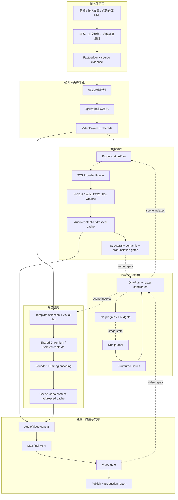

# 架构说明

Scene Gen 是一个以 run 为隔离边界、以结构化协议连接各阶段的媒体生成流水线。核心目标是让生成可验证、失败可恢复、修复范围可计算。

## 系统框架



## 执行阶段

| 阶段 | 主要输入 | 主要输出 |
| --- | --- | --- |
| `ingest` | URL、用户反馈 | 来源内容、内容类型、反馈约束 |
| `draft` | 来源、目标时长、事实账本 | `VideoProject`、故事规划与候选分数 |
| `draft-gate` | 项目、来源证据 | 脚本质量 issue 与修复建议 |
| `revise` | issue、JSON Patch、策略轨迹 | 局部修订后的项目 |
| `synthesize` | 旁白、发音计划、Provider | 分场景 WAV、总旁白、音频指标 |
| `audio-gate` | WAV、旁白、ASR/音素证据 | 结构、语义和发音 issue |
| `render` | 场景、模板、音频时间轴 | 分场景视频、合并画面、最终 MP4 |
| `video-gate` | MP4、DOM/帧证据 | 尺寸、空白、溢出、同步等 issue |
| `publish` | 通过门禁的产物 | 最终视频、生产报告、反馈 outcome |

每个阶段返回 `StageResult`，包含状态、输入哈希、输出、issues、metrics、耗时、attempt 和建议动作。阶段异常也会写入 run journal。

## 核心数据协议

### VideoProject

`VideoProject` 是内容、音频和渲染共享的项目协议。它保存来源、事实引用、场景、旁白分段、音频时间轴、模板计划和输出路径。持久化边界由 Zod 校验，不能依赖 TypeScript 类型断言跳过运行时验证。

### FactLedger

事实账本将主体、谓词、值、限定条件和来源证据拆成声明。标题、场景和旁白通过 `claimIds` 引用声明，质量门据此检查数字、时间、主体、高风险动作和限定词。详见 [FACT_LEDGER.md](FACT_LEDGER.md)。

### PronunciationPlan

发音计划分离：

- `displayText`：字幕与项目原文；
- `semanticText`：ASR 和语义核对文本；
- `synthesisText`：Provider 实际合成文本；
- `spans`：短语位置、拼音、来源、风险和 fallback；
- `planHash`：场景级音频缓存身份的一部分。

Provider 不直接猜测原始文本发音，而是消费统一计划并转换为各自支持的 phoneme、词典或 fallback 表达。

### QualityIssue 与 DirtyPlan

Issue 是跨阶段稳定协议；`DirtyPlan` 将 issue 映射为最小重生成集合：

```ts
interface DirtyPlan {
  audioSceneIndexes: number[];
  videoSceneIndexes: number[];
  concatAudio: boolean;
  concatVideo: boolean;
  remux: boolean;
  fullRebuild: boolean;
  reasons: string[];
}
```

## Run 隔离与持久化

每次运行使用 `dist/runs/<run-id>/`：

```text
dist/runs/<run-id>/
  run.json
  generation-result.json
  manifest.json
  evaluations/
  loop/
  reports/
  cache-refs.json
```

`run.json` 从运行开始即创建，每完成一个阶段原子更新。它保存脱敏 RuntimeConfig 快照和哈希；resume 默认复用原配置，除非显式使用 `--override-config`。

持久化格式通过版本检测和 migration reader 读取。旧 run 在迁移前会备份，格式版本与缓存 identity 版本相互独立。详见 [PERSISTENCE_MIGRATIONS.md](PERSISTENCE_MIGRATIONS.md)。

## 内容寻址缓存

全局缓存位于：

```text
dist/cache/audio/
dist/cache/video-scenes/
dist/cache/metadata/
```

音频身份包含 Provider、模型、规范化合成文本、发音计划、参考音频、速度和前端版本。视频身份包含场景 JSON、模板和 variant、尺寸帧率、素材、字体、CSS、Chromium/Playwright、编码 profile 和 renderer 版本。

缓存写入使用临时文件、校验和原子 rename。同一 key 的并发请求通过 single-flight 合并，其他任务等待首个生成结果。活动 run 的缓存引用会阻止 prune 误删。

## 并发模型

- NVIDIA 与本地大模型语音使用 Provider 级队列；单 GPU 本地模型默认并发 1；
- 文本预处理、哈希、缓存查询和 FFprobe 使用独立有界并发；
- 一个项目只启动一个 Chromium，场景使用独立 BrowserContext/Page；
- FFmpeg 线程预算随渲染并发分配，避免每个进程占满全部 CPU；
- 任一场景失败会停止未开始任务，保留已完成的内容寻址缓存。

性能和 benchmark 见 [PERFORMANCE.md](PERFORMANCE.md)。

## 模块导航

| 目录 | 职责 |
| --- | --- |
| `src/cli/` | 正式 CLI、严格参数解析 |
| `src/config/` | RuntimeConfig、Profiles、脱敏快照 |
| `src/pipeline/` | 抓取、故事、事实、发音、TTS 和渲染入口 |
| `src/pipeline/tts/providers/` | Provider 适配器 |
| `src/harness/` | 阶段状态机、质量协议、修复和恢复 |
| `src/harness/quality/` | Draft、Audio、Video 与 Judge 规则 |
| `src/html-video/` | HTML 场景录制、视觉审计和渲染预算 |
| `src/templates/` | 场景模板、选择与历史学习 |
| `src/cache/` | 内容寻址缓存和清理工具 |
| `src/production/` | Provider 历史、报告和发布统计 |
